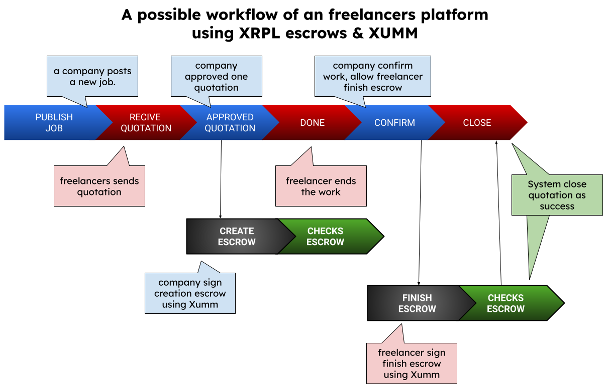

<p align="center">
  <a href="" rel="noopener">
 </a>
</p>
<h3 align="center">Xumm Hub Prototype</h3>
<h4 align="center">XRPL Summer 2032 Hackathon | Ripple</h4>
<div align="center">

[](https://dorahacks.io/hackathon/xrpl-hackathon/)
[]()
[](https://github.com/kylelobo/The-Documentation-Compendium/issues)
[](https://github.com/kylelobo/The-Documentation-Compendium/pulls)
[](LICENSE.md)

</div>

---

<p align="center"> 
  With this project we seek to learn from the XRP Ledger technology, while we build a working prototype of a platform for freelancers and companies using Ripple technology. In other words, we explore the possibility of building "The Xumm Hub" as the business center of Xumm.

   <b> XummHub: Would be an open xApp freelancers-plataform where businesses and freelancers that currently use XRP (the early adopters) can start connecting each other.</b>
</p>

## 📝 Table of Contents

- [Business opportunity](#idea)
- [Challenges and Opportunities](#challenges_and_opportunities)
- [Learning Technology Stack](#tech_stack)
- [Dependencies / Limitations](#limitations)
- [Future Scope](#future_scope)
- [Setting up a local environment](#getting_started)
- [Usage](#usage)

- [Contributing](../CONTRIBUTING.md)
- [Authors](#authors)
- [Acknowledgments](#acknowledgments)

## 💡 Business opportunity <a name = "idea"></a>

The business idea behind the project is to create a freelancer portal that uses the XRP Ledger escrow technology to ensure safe custody of payments. By taking advantage of this technology, the platform eliminates the need to directly maintain and guard users' money, which in turn allows avoiding abusive commissions for management (up 20%) and currency exchanges.

On the other hand, if you have ever worked on these current platforms, you will know that their terms often limit communication between companies and freelancers to only the platform, and border on illegal, even allowing the license to read the messages that companies make. and businesses on their platform, looking for them not to do business through other means than the platform itself, all due to the fact that they seek those abusive commissions... not to mention that they retain the money for periods of 30 days or more , as well as making changes between currencies totally out of the market... all at plataform complete discretion, without any justification... with blockchain technology all this will change for the better for companies and freelancers.

It would not be strange to think that, in the future, when the adoption of blockchain technology is more widespread, these freelance platforms will have to change their business models and open the doors to the new world of business and international transfers, which will speak a common language: Speed, Efficiency and Freedom.

That is why our project seeks, in a few weeks, to try to learn how technologies such as XRP Ledger will allow us to build freelance platforms in the future, where:

- Commissions are zero (or very low).
- The rules are set by companies and freelancers, not by platforms.
- Freelancers get paid on time efficiently, and without waiting. 
- …

In summary: 
> Your work, your rules, your earnings: No commissions on your success path!


## 🧐 Challenges and Opportunities <a name = "challenges_and_opportunities"></a>

The challenges at the business level lead us towards the technical challenges that we will address later in this huge spike.

### Busines Chanllenges

- **Guarantee Payments and Compliance:**
  Ensuring that both freelancers and clients are protected in terms of payments is essential. Implementing an escrow system (such as the use of escrows in the XRP Ledger) can resolve this concern, but it must be carefully managed so that both parties are satisfied. Clear rules must be defined on when and how payments are released to avoid misunderstandings.

- **Dispute resolution:**
  Disputes are inevitable on any freelance platform. Having a transparent and efficient process to resolve disputes is critical to maintaining trust in the platform. Implementing an impartial mediation or arbitration system can help resolve issues fairly and prevent disputes from escalating to harmful levels. In the future, thanks to smart contracts, we could address this point to minimize the risks associated with hiring a freelancer as well as working for a company that is not very responsible with payments.

- **Trust and Security:** Trust and security are  crucial to attract both freelancers and clients. Transparently showing how payments and personal information are handled, as well as using strong cybersecurity measures, can build trust among users. Education about security practices and constant communication about privacy policies are also important to building lasting relationships.

  At this point, we do not have to invent the wheel, we can integrate with Xumm so that this is the platform that manages the signatures of the escrows and transfers, allowing us to delegate all those extensive security responsibilities associated with Xumm. This also allows us to give users confidence that our system will not work at any time with the keys of our users' wallets.

- **Intense Competition:** The freelance platforms market are highly competitive, which means that any new platform must stand out to attract freelancers and clients. This implies that a large part of the costs would be allocated to marketing.

  However, **there are an unique opportunity to reduce these costs**, if this freelancer-platarform was integrated into the Xumm application marketplace and **therefore was at the heart of the XRP ecosystem (i.e XUMM)**, marketing costs would be very low since our platform is free of charge. It would be accessible to all current and future users of the XRP ecosystem. We are talking about a global service for all XRP Ledger users.
 

### Tech Chanllenges

The main challenges, which we have addressed in this huge spike, related to the implementation of this project using Ripple's technology are the following:

- Escrows [^1]:

  <p align="center">
  
  </p>

  At this spike project, we have tried to implement a possible workflow for our platform using trusts. As can be seen in the image above, the main statuses of the job (and its approved quotation) are:

  * **PUBLISH**: Company publish a new job, the freelancers can send quotations.
  * **APPROVED**: Company approved one quotation, and should sign the creation of escrow with Xumm. The "create_escrow" payload will take the parameters (total_amount, dealine in days) gived by freelancer on its quotation, and will creats a condition and its fullfillment (we will save it encripted on our DB)
  * **DONE**: When freelance finish the work, will notificate plataform and company.
  * **CONFIRMED**: After work is ready, Company will have to confirmed that job is succesfull finished before for allow our platform to make free the escrow condition fulfillment for freelance.
  * **CLOSED**: After, freelancer finish escrow and our system checks that all its success, we will close quotation, but they will can continue working using our direct tranfers system.

  ```edgedb
    # Edgedb State quotation
    scalar type StateQuotationEscrow extending enum<NONE,BUILED,WAITING_XUMM_SIGN,CHECKED,WAITING_XUMM_SIGN_FINISH,FINISHED>;

    scalar type StateQuotation extending enum<PUBLISHED, APPROVED, DONE, CONFIRMED, CLOSED>;
  ```

  > [!NOTE]
  > Please dont forget that all that is an huge draft, that allow us learn on deeply how would could implemented that kind of plataform, take leasons and learn how integrate workflows with XRPL & Xumm. For example, now, we consider that the escrows would should be more independent allowing that into a job, **the company and freelance would be able to create multiple escrows workflows (and not only one)**. Also would be interesting **introduce the concept of task and can have diferent workflows in parallel**, something that could be usefull for limite scopes, accelerate the delivering, checking processes and avoid conflicts.

  **The escrows XRPL can be key for build a trust relationship between _honest people_ and _honest companies_**. Once a company creates a escrow linked with the wallet of freelance, this last knows that there are full (or partial) deposit of the project budget. It is helps the trust, and can motivate that freelance work faster (increasing the rate % of satisficing delivery dates 🔮) because that deposit will have a expiration time. Of course, there are many dark points (expiration of escrows, quality of works, scams... in short, disputes) at business level that we would study carefully... 🙋📚


  - Escrows [^1] vs Payment Channels [^2]:

    We should say that in the first place, we studied using the use of payment channels, however, we found the limitation that some processes of the payment channel flow are not transactions but methods, this made integration with Xumm difficult, since as we have established, we will delegate to this all security responsibilities that will control the private keys, sign and send the transactions.

    <p align="center">
    
    </p>

    That is why, later, we opted to use Escrows, which is similar, but follows a much simpler flow than payment channels where there are only transactions. 


- XUMM integration: We really liked how Xumm facilitates the login and logout of users in our application, however, we have implemented our own associated authorization system so that we do not have to ask Xumm every time if a user has the permissions or not, to access to a route or endpoint of our api.

- Direct Transfers:
  @TODO


💡 Proposal: We think that it would be interesting within the ecosystem to offer templates, ready-made skeletons to speed up the creation of new projects and prevent new developers from wasting days learning how to integrate with Xumm and launch transactions to XRP Ledger through it. 

## ⛓️ Dependencies / Limitations <a name = "limitations"></a>

- What are the dependencies of your project?
- Describe each limitation in detailed but concise terms
- Explain why each limitation exists
- Provide the reasons why each limitation could not be overcome using the method(s) chosen to acquire.
- Assess the impact of each limitation in relation to the overall findings and conclusions of your project, and if
  appropriate, describe how these limitations could point to the need for further research.

## 🚀 Future Scope <a name = "future_scope"></a>

Write about what you could not develop during the course of the Hackathon; and about what your project can achieve
in the future.


## ⛏️ Built With <a name = "tech_stack"></a>

Apart from learning about XRPL technology I have left my comfort zone and have used a new Stack (Edgedb + Python & Flask + InfernoJs) with propouse of learn and test new things:

- [Edgedb](https://www.edgedb.com/) 
  > EdgeDB is an open-source database designed as a spiritual successor to SQL and the relational paradigm. It aims to solve some hard design problems that make existing databases unnecessarily onerous to use.
  Powered by the Postgres query engine under the hood, EdgeDB thinks about schema the same way you do: as objects with properties connected by links. It's like a relational database with an object-oriented data model, or a graph database with strict schema. We call it a graph-relational database.

  I really wanted to try the edgedb migration system and I really liked the results a lot. Any current project requires that the database schema evolve quickly and more if we talk about a spaik where we do not know everything we need, we have been able to update the database schema (/server/dbschema/default.esdl) , create new migrations (`make edgedb-migration-create`) and apply them on our database (`make edgedb-migrate`) easily. After you can write your queries (see ./server/queries/...) using a simple edgeSQL sintax and generate python code `make edgedb-gen` that after you can call on your code. Really fast dev cycle :).
  
  In production we could would worked with Edgedb+Postgres therefore really recommended EdgeDB! 👍

- [Python + Flask](https://flask.palletsprojects.com/en/2.3.x/) 

  I usually use python when I need to integrate with third-party systems given the number of libraries it has... what can I say about python and flask that hasn't already been said... simplicity!

  However, I must admit that being used to other languages like TypeScript, Elixir, and Rust I don't feel the code is clean, or I still haven't found the point, I'm sorry :(. Obviously this code is only for exploring and learning from technology XRP as well as figuring out what we would need to be able to build a real freelancer platform using this technology, so Python and Flask is more than enough for a Spike.


- [InfernoJs](https://www.infernojs.org/)

  I admit it, maybe I'm from the old school but I don't like that the frontend limits my stack... many current frameworks tend little by little to depend on backends and therefore to condition how you develop. I like the freedom to choose the technologies I work with, and that's why it's hard for me to find frontend frameworks that I feel comfortable with.

  In this case, to take advantage of the project I have tried the Inferno Js framework inspired by React, and the truth is, I really liked that I could easily start working despite using Flask.

## 🏁 Getting Started <a name = "getting_started"></a>

See our [XummHub Prototype - Installation & Setup Guide](/docs/XummHub%20Prototype%20-%20Installation%20Guide.md)

## ✍️ Authors <a name = "authors"></a>

- [@ricardombiot](https://github.com/ricardombiot/xapp_freelancer) 


## 🎉 Acknowledgments <a name = "acknowledgments"></a>

- Hat tip to anyone whose code was used
- Inspiration
- References


[^1]: XRPL | Escrows - https://xrpl.org/escrow.html

[^2]: XRPL | Payment Channels - https://xrpl.org/payment-channels.html